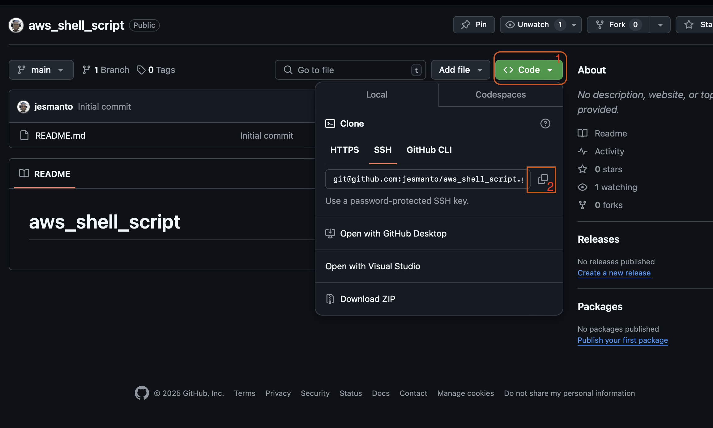
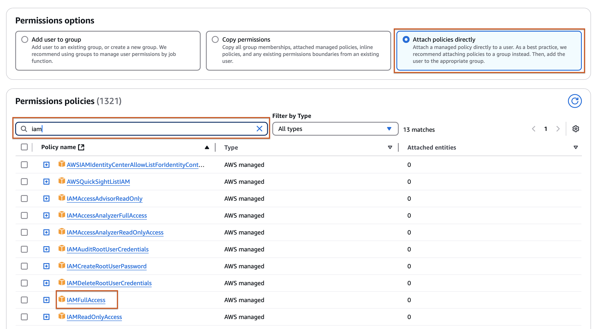
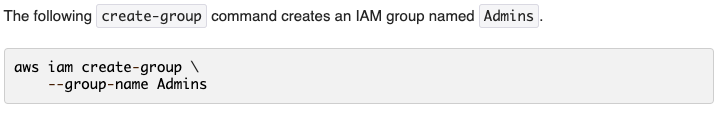

# Shell Script for AWS IAM
## Setup Git repository
- [Login to your github account]("http://github.com") and click on New.
- Provide the necessary details like the repository name and check the readme file option. See image below


- After suppying the necessary information, click on `Create Repository`. 
- On the repository page, copy out the repository link. You will need it to clone the repository to your local machine. See image below


- On you local machine, open your terminal.
- Navigate to the directory you desire to clone your repository.
- Use the clone command to clone your repo. In my case I used `git clone git@github.com:jesmanto/aws_shell_script.git`. See image below.


NOTE:
>From the image above, I moved the `aws_cloud_manager.sh file` from the home directory to the repository using the command `mv ~/aws_cloud_manager.sh ./aws_shell_script`

Now Git has been successfully setup.
## Assign IAM permission to the User
Before now, the user only had EC2 and S3 permissions, hence cannot perform  IAM operations. To allow the user perform IAM operations, we need to assign IAM permission to the user.
- Login to AWS console as a root user
- Navigate IAM AWS services from the search box.


- Click on **Users** and select the user to edit.


- Click on the user to open the details. Under the **Permissions** tab, click on `Add Permissions` dropdown menu and select `Add Permissions`.


- Click on `Attach policies directly`. Search for **IAM** and select the checkbox attached to **IAMfullaccess** from the list of permissions.


- Review the permission and add permission to the user.


## Add IAM functions to the existing shell script
Before adding the functions to create users, groups and attach policies to the script, we need to first go through the AWS CLI documentation on IAM. Check this website. [AWS CLI Reference (IAM)](https://docs.aws.amazon.com/cli/latest/reference/iam/).
    


**NOW LET'S BEGIN!!!**

### Store the IAM user names in an array
Use this line of code below to define an array of IAM users.

```iam_users=("John" "Tom" "Ezi" "Tim" "Sam")```

### Create IAM Users
According to the documentation, Users can be created by using the `aws iam create-user` command, with various options. The following create user command creates an IAM user named `Bob`


Modifying `aws_cloud_manager.sh` script. I will add the function below
```
# Function to create IAM Users
create_iam_users() {
	for user in "${iam_users[@]}"; do
		aws iam create-user \
			--user-name $user
		if [[ $? -eq 0 ]]; then
			echo "IAM User '$user' created successfully"
		else
			echo "Failed to create IAM User '$user'"
		fi
	done
}
```
I created an array of the names of the employees of Cloudops Solutions, then iterated through the array to create a user profile for each employee.

### Create IAM Group
The command to create an IAM group as seen in the documentation is shown below.


Modifying `aws_cloud_manager.sh` script. I will add the function below
```
group_name="admin"

# Function to create IAM Group
create_iam_group() {
	aws iam create-group \
		--group-name $group_name

	# Check if the group was created successfully
	if [[ $? -eq 0 ]]; then
		echo "Group $group_name created successfully."
	else
		echo "Failed to create $group_name group."
	fi
}
```
`group_name` variable was created for reusability

### Attach Administrative Policy to Group
The command below is used to attach policy to a group.

```
attach-group-policy
--group-name <value>
--policy-arn <value>
```
Modifying `aws_cloud_manager.sh` script. I will add the function below, replacing group-name value with `admin` and policy-arn with `arn:aws:iam::aws:policy/AdministratorAccess`

```
# Function to attach administrative policy to group
attach_policy_to_group() {
	policy="arn:aws:iam::aws:policy/AdministratorAccess"
	aws iam attach_group_policy \
		--group-name $group_name \
		--policy-arn $policy

	# Check if the group policy was attached successfully
	if [[ $? -eq 0 ]]; then
		echo "Group $policy attached successfully."
	else
		echo "Failed to attach $policy to group $group_name."
	fi
}
```

### Attach Users to Group
Similar to using AWS Console, Users can also be attached groups using CLI commands. This can be done as shown below

```
add-user-to-group
--group-name <value>
--user-name <value>
```

We will iterate through the array containing the names of the employees again to attach each of them to the group we recently created.

```
# Function to attach users to group
attach_users_to_group() {
	for user in "${iam_users[@]}"; do
		aws iam add-user-to-group \
			--group-name $group_name \
			--user-name $user

		# Check if user was attached to group successfully	
		if [[ $? -eq 0 ]]; then
			echo "IAM User '$user' attached to $group_name group successfully"
		else
			echo "Failed to attach IAM User '$user' to $group_name group"
		fi
	done
}
```

## Error Handling
Error handling is a very crucial part of writing scripts or codes.

While adding the functions, there are checks to know if the operation was successful or not. This is to ensure users are fully aware of the results of the operations. We will be modify the functions to include a check to know if the user or group already exists, before creating new ones.

### Modifying the create_iam_users and create_iam_group functions
```
# Function to create IAM Users
create_iam_users() {
	for user in "${iam_users[@]}"; do
		aws iam get-user --user-name $user
		if [[ $? -eq 0 ]]; then
			echo "User already exists"
		else
			aws iam create-user \
				--user-name $user
			if [[ $? -eq 0 ]]; then
				echo "IAM User '$user' created successfully"
			else
				echo "Failed to create IAM User '$user'"
			fi
		fi
	done
}
```
I add a new command `aws iam get-user --user-name $user` to fetch the profile of the user. Then used `$?` to check the status of the last command. If it returns 0, it shows that the user already exists, so the opration will be skipped, else a new user will be created.

>The same process was repeated for the `create_iam_group` function.

## Results
|           Result 1          |          Result 2            |
| ------------------- | -------------------- |
|  |  |

## Confirmation from the console

>EC2 Instances 


>S3 Buckets


>IAM Users 


>IAM User Group


## Push to Github


## Best Practices
- Usernames must be unique to individual employees
- Employees should be only be given the permissions they need for their job
- If more than one employee has same job role, add them to a group and attach a policy to the group
- Check naming conventions of any resources before creating one

## Challenges Faced
- When I ran the the script for the first time, I got series of errors, ranging from syntax to configuration errors. In the image shown below, all the commands failed because Testing profile was not found. 


- After fixing the errors, I ran it again and S3 buckets were not created because of wrong naming cnoventions. S3 bucket names must not have uppercase letters.

## Troubleshooting
I took the following steps
- I identified the causes of the errors and fixed them
- Quickly changed my AWS_PROFILE to default
- I also compared the commands from the AWS CLI documentation to the one I have on my script, and discovered there were a lot of errors as a result of wrong spellings. I corrected them

## Lessons Learned
- I learnt how to work with AWS CLI
- I learnt how to read and understand AWS CLI documentation
- I learned how to automate processes using shell scripts